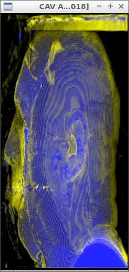

## Introduction
Volume data requires being visualized in order to provide meaningful information that helps to interpret its content. There are several techniques to accomplish such goal. In this report, I present the details of an implementation of volume rendering based on the Composite Intensity Projection method. This technique aims to render the volume data using the intensity values of all the voxels intersected by a ray.

## Implementation
First, I visualized the type of data contained in the volume in 2D. This helped me to get a more intuitive idea of the distribution of the intensity values along a single ray. The visualization was performed along a single dimension of the volume, as seen in Image 1. The animation shows three components; the main one (in the center) shows the intensity values in every slice of the volume data along its depth. The left one corresponds to the position and direction of the ray; the ray intersects the voxels from left to right. The right one shows the variation of the values in the volume elements intersected by the ray.

**Image 1**

The red plot shows the intensity values at each voxel intersected by the ray. The blue line is the accumulated opacity using the equation  `accumulated_opacity = current_intensity + (1 - current_intensity) * accumulated_opacity` where `current_intensity` is the scalar value contained in every voxel of the volume data; `accumulated_opacity` is calculated iteratively along the voxels intersected by the ray. Finally, the white line shows the relative intensity of the voxel using the equation `relative_intensity = (1 - accumulated_opacity) * current_intensity`.

The plots give a better idea of the distribution of the intensity data. It is clearly evident how some areas of the data are more intense than others. The accumulated opacity increases along the ray as new intensity values are added to it. However, there is a limit where such increase is no longer happening, which means that the contribution of further intensities do not affect the final opacity. The limit in the increase of the accumulated opacity impacts the relative intensity of the voxels as well. At some point, the relative intensity of the voxels is zero. The reason is the accumulation of opacity; some voxels are no longer visible since the intensity of previous voxels filled all the available opacity.

Based on the previous analysis, I implemented the volume rendering. I calculated the accumulated opacity and relative intensity using the same equations described before. However, to define the actual color of the pixel in the image, I used a transfer function based on two thresholds to defined the ranges for the empty space, the outer layer (skin), and the inner content (bones). The first range is meant to avoid small intensities which correspond to empty space (air) in the volume data. Any relative intensity in that range is discarded and does not influence the final color of the corresponding pixel. Relative intensities in the middle range add skin color (yellow) to the pixel. Relative intensities in the last range add skull color (blue) to the pixel.

Finally, I also implemented trilinear interpolation to increase the resolution of the final image. This was done by iteratively calculating the values between two consecutive intensities in a given direction and integrating them. This process ended up doubling the size of the volume data in every dimension, which means that the new data was bigger than the original one by a factor of 8. 

## Results

The first results are displayed in Image 2. As seen, the implementation gives results where the skull is not displayed. The reason for this is the accumulated opacity. As seen in Image 1, the accumulated opacity reaches its maximum value before reaching the voxels corresponding to the bones. 

**Image 2**

To correct the previous problem, the intensity of every voxel is reduced by a factor of three, so the accumulated opacity reaches its maximum by including information from inner structures like the bones. The result of this modification is displayed in Image 3. As seen, now the skin and the skull are clearly identifiable. The distinction is done based on the intensity of the blue color rather than a change in the tone.

**Image 3**

## Conclusions

The visualization of 3D volume helps to better understand the structure of the data. The objective is to provide meaningful information that helps to interpret the type of data delivered from different sources. There are several techniques to accomplish the volume visualization. One of them is based the Composite Intensity Projection. As seen in this report, its implementation requires some knowledge of the type of information contained in the volume. 